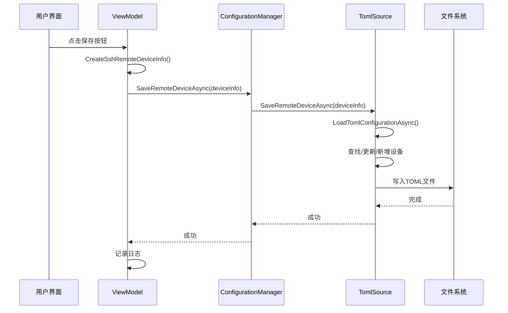

# 配置保存功能技术指南

## 功能概述

实现了设备配置的保存功能，用户可以通过界面上的【保存】按钮将当前编辑的SSH设备配置保存到JSON文件中。

## 📜 技术演进历史

### TOML时代 (已废弃)
- 曾经使用TOML格式进行配置存储
- 使用 `TomlRemoteDeviceConfigurationSource` 进行文件读写
- **废弃原因**: AOT兼容性问题，Tomlet库依赖反射

### JSON时代 (当前)
- 使用JSON格式 + System.Text.Json + 源生成器
- 使用 `JsonRemoteDeviceConfigurationSource` 进行文件读写
- **优势**: AOT兼容、性能优异、官方推荐

## 技术架构

### 1. 接口设计

```csharp
public interface IRemoteDeviceConfigurationSource
{
    string GroupName { get; }
    Task<IReadOnlyList<IRemoteDeviceInfo>> FetchRemoteDevicesAsync();
    Task SaveRemoteDeviceAsync(IRemoteDeviceInfo deviceInfo);
    Task RemoveRemoteDeviceAsync(string connectionName);
}
```

**核心原则**：
- 每种配置源负责保存自己的数据
- 支持增量保存（新增/更新/删除）
- 异步操作，不阻塞UI

### 2. 实现层次

```
UI层 (SshRemoteDeviceInfoView.axaml)
  ↓ [Command绑定]
ViewModel层 (SshRemoteDeviceInfoViewModel)
  ↓ [SaveConfigurationCommand]
管理层 (ConfigurationManager)
  ↓ [SaveRemoteDeviceAsync]
数据源层 (JsonRemoteDeviceConfigurationSource)
  ↓ [SaveRemoteDeviceAsync]
文件系统 (devices.json)
```

### 3. 关键组件

#### 3.1 ConfigurationManager
- **职责**：统一管理多种配置源
- **路由逻辑**：根据设备类型选择合适的配置源
- **错误处理**：统一的异常处理和日志记录

#### 3.2 JsonRemoteDeviceConfigurationSource
- **职责**：JSON文件的读写操作
- **更新策略**：根据设备名称查找并更新或新增
- **文件安全**：确保目录存在，原子性写入
- **AOT兼容**：使用源生成器进行序列化，避免反射

#### 3.3 SshRemoteDeviceInfoViewModel
- **职责**：UI数据绑定和命令处理
- **数据转换**：ViewModel → SshRemoteDeviceInfo
- **用户反馈**：保存成功/失败的日志记录

## 实现细节

### 1. 保存流程



### 2. 数据转换

**ViewModel → SshRemoteDeviceInfo**：
```csharp
private SshRemoteDeviceInfo CreateSshRemoteDeviceInfo()
{
    var SyncDirectories = SyncDirectories.Select(sg => new DirectorySyncingModel
    {
        Name = sg.Name,
        RemotePath = sg.RemotePath,
        LocalPath = sg.LocalPath,
        Enabled = sg.Status != DirectorySyncingStatus.Disabled
    }).ToList();

    return new SshRemoteDeviceInfo
    {
        ConnectionName = ConnectionName,
        Host = Host,
        Port = Port,
        UserName = UserName,
        Password = Password,
        SyncDirectories = SyncDirectories
    };
}
```

### 3. 文件操作

**原子性保存**：
```csharp
private async Task SaveTomlConfigurationAsync(TomlDeviceConfiguration configuration)
{
    // 确保目录存在
    var directory = Path.GetDirectoryName(_configurationPath);
    if (!string.IsNullOrEmpty(directory) && !Directory.Exists(directory))
    {
        Directory.CreateDirectory(directory);
    }

    // 转换为 TOML 格式并保存
    var tomlContent = TomletMain.TomlStringFrom(configuration);
    await File.WriteAllTextAsync(_configurationPath, tomlContent);
}
```

## 已知问题

### 1. 设备标识符问题

**问题描述**：
- 当前使用设备名称（ConnectionName）作为唯一标识符
- 如果用户修改设备名称，会被识别为新设备
- 导致原设备配置保留，新设备配置重复

**影响范围**：
- 设备重命名会产生重复配置
- 旧配置不会自动清理

**建议解决方案**：
1. 为设备添加唯一ID（GUID）
2. 使用ID作为主要标识符，名称仅用于显示
3. 实现配置迁移逻辑

### 2. 错误用户反馈

**当前状态**：
- 保存错误仅在日志中记录
- 用户无法直观了解保存状态

**改进建议**：
- 添加保存状态提示（成功/失败）
- 实现错误对话框或状态栏提示

## 测试要点

### 1. 功能测试
- [ ] 新设备保存
- [ ] 现有设备更新  
- [ ] 目录同步配置保存
- [ ] 文件不存在时创建
- [ ] 目录不存在时创建

### 2. 异常测试
- [ ] 文件权限不足
- [ ] 磁盘空间不足
- [ ] 无效的TOML格式
- [ ] 网络存储路径

### 3. 并发测试
- [ ] 多设备同时保存
- [ ] 文件被其他进程占用

## 日志规范

```csharp
// 成功日志
Log.Info($"[Config] 设备配置保存成功: {deviceInfo.ConnectionName}");

// 错误日志  
Log.Error($"[Config] 保存设备配置失败: {deviceInfo.ConnectionName}, 错误: {ex.Message}");

// 调试日志
Log.Debug($"[Config] 更新现有设备配置: {sshDeviceInfo.ConnectionName}");
```

## 扩展考虑

### 1. 多配置源支持
- 数据库配置源
- 云端配置同步
- 加密配置源

### 2. 配置版本管理
- 配置历史记录
- 回滚功能
- 配置差异对比

### 3. 团队协作
- 配置分享功能
- 团队配置模板
- 配置权限管理

---

**更新时间**：2025年7月9日  
**版本**：v1.0  
**状态**：基础功能完成，需要解决标识符问题
